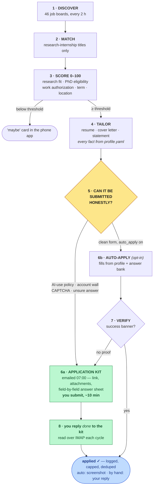

# jobbot — a research-internship application agent that finds, scores, prepares, and (only when it's honest to) submits

A 24/7 service for PhD students hunting AI/ML research internships. It polls
~46 public job boards every two hours, scores every posting against **your**
research profile, generates tailored materials from **your** CV, and either
submits the application itself or — for the growing set of employers whose
portals need an account or whose forms ask you to attest that no AI was used —
emails you a complete **application kit** so submitting is a ten-minute task.

It was built for one person's search and then generalised. Everything
candidate-specific lives in two files you own (`profile.yaml`, `config.yaml`);
nothing about you is in the code.



**Closing the loop on manual submissions.** Kits carry a posting id in the
subject (`[jobbot KIT #123]`). Reply `done` once you've submitted and the bot
reads it over IMAP on the next cycle and records the application; reply `skip`
and the posting is dropped. Only your own words count — quoted text from the
kit itself is ignored, so nothing is marked applied by accident. Anything still
unanswered appears in the next digest under *awaiting your submission*
(`jobbot.main pending`, or `jobbot.main applied <id>` from a terminal).

Everything lands in SQLite (`postings`, `applications`, screening Q&A log,
answer bank, watcher health) and is visible in the token-protected dashboard and
phone swipe app. A daily digest summarises new postings, submissions, the manual
queue, and any watcher that silently broke.


## What it actually does

| Stage | Module | Behaviour |
|---|---|---|
| **Discovery** | `discovery/` | Greenhouse, Lever, Ashby, SmartRecruiters, Workable, Workday, Eightfold public APIs; Amazon jobs; HN "Who is hiring"; Remotive. Each watcher is isolated — one broken board never stops the rest. Watcher health is in the digest and dashboard. |
| **Matching** | `matching.py` | Keeps research-internship titles; drops undergrad-only, pure SWE, clearance roles. Detects postings whose text restricts AI-assisted applications. |
| **Scoring** | `scoring.py` | 0–100: research-area overlap (weights from `config.yaml`), PhD eligibility, US work-authorization feasibility, term fit, preferred-location bonus. Non-US postings are penalised (student visas are country-bound). |
| **Tailoring** | `tailor/` | Claude *selects and orders* your profile for the job — every bullet is verbatim from `profile.yaml`. Resume → PDF via Chromium; cover letter (<300 words, names the team); research statement. All saved under `materials/<company>_<role>_<date>/` for audit. |
| **Filling** | `apply/forms.py` | Headless Chromium. Identity fields from profile; resume via a real file chooser; ARIA comboboxes handled; screening questions answered from your **answer bank** first, then Claude with the profile as the only source of truth and a confidence flag. |
| **Safety gates** | `apply/__init__.py` | Required question without a confident answer → your phone; references / transcripts / advisor / salary → always you; account wall or CAPTCHA → manual card, never bypassed; employer restricts AI → never auto-submitted; caps 5/day, 2/company/week, 90-day dedupe; `STOP` file halts everything. |
| **Submit + verify** | `apply/forms.py` | Records "applied" only on a visible success banner, with a screenshot. A click alone is never counted. |
| **Kits** | `kit.py` | Morning email per qualifying posting: link, attachments, and an answer sheet scanned from the live form. Employers that restrict AI get your own CV and source material instead of drafts. |
| **Reply tracking** | `inbox.py` | Reads `done` / `skip` replies to kit emails over IMAP so hand-submitted applications are recorded, counted against caps, and deduped. Parses only your unquoted words. |
| **Notify** | `notify.py` | Email receipt per submission, daily digest, instant alerts for top-tier companies; falls back to `reports/` files without SMTP. |
| **Dashboard + phone app** | `dashboard.py` | Token-protected FastAPI on your tailnet: history, watcher health, and a swipe queue — right = apply, left = skip, question cards answered once and remembered forever. |

## Honest results, and why kits exist

Seven weeks of one real search: the auto-submit path completed **3 verified
applications** (Cohere, Physical Intelligence, Amazon Science), while **18
postings** — including the best fits — stalled behind Workday account walls,
hCaptcha, and a new kind of form field: *"I attest that no AI tools were used
in this application."* An AI cannot honestly tick that box for you. So the
default mode is now **kits**: the bot does everything up to the submit button
and hands you the rest. `auto_apply: true` turns the submit path back on for
Greenhouse/Lever/Ashby forms that carry no such policy.

## Quick start (local, dry run)

```bash
git clone https://github.com/abhinavkochar9/jobbot && cd jobbot
python3 -m venv .venv && .venv/bin/pip install -r requirements.txt
.venv/bin/python -m playwright install chromium

cp profile.example.yaml profile.yaml   # fill in — this is the only source of truth about you
cp .env.example .env                   # add ANTHROPIC_API_KEY; DRY_RUN=true is the default

PYTHONPATH=src .venv/bin/python -m jobbot.main discover     # one sweep of every board
PYTHONPATH=src .venv/bin/python -m jobbot.main report       # scored postings
PYTHONPATH=src .venv/bin/python -m jobbot.main tailor 12    # materials for posting #12
PYTHONPATH=src .venv/bin/python -m jobbot.main apply --limit 1   # DRY_RUN: fills + screenshots, never submits
PYTHONPATH=src .venv/bin/python -m jobbot.kit 3             # email yourself 3 application kits
PYTHONPATH=src .venv/bin/python -m jobbot.main pending      # kits awaiting your submission
PYTHONPATH=src .venv/bin/python -m jobbot.main applied 12   # record one you submitted by hand
```

Everything the bot generates is inspectable: `materials/` (what it wrote),
`evidence/` (screenshots of every fill and confirmation), `data/jobbot.db`
(SQLite: postings, applications, screening Q&A log, answer bank, watcher health).

## Reproduce the 24/7 deployment

Any Linux box with Python 3.11+ and systemd (a $5 VPS works).

```bash
JOBBOT_HOST=<ssh-alias> bash deploy/deploy.sh   # rsync, venv, Chromium, systemd user unit, linger
scp .env <ssh-alias>:jobbot/.env                 # secrets never travel in git
ssh <ssh-alias> 'systemctl --user start jobbot && tail -f jobbot/logs/service.log'
```

`deploy/jobbot.service` runs `jobbot.main run`: discovery every 2 h, the queue,
kits + digest at 07:00 local, auto-restart, logs in `logs/`. Config reloads every
cycle; code changes need a restart. The dashboard binds to localhost by default
— reach it with `ssh -L 8787:127.0.0.1:8787 <ssh-alias>`, or set
`DASHBOARD_HOST` to your Tailscale IP and open it from your phone
(`/app?token=<APP_TOKEN>`). If you want HTTPS on the phone, `tailscale serve
--bg http://127.0.0.1:8787` gives you a real certificate on your tailnet.

## Configure it for *your* search

| File | What to change |
|---|---|
| `profile.yaml` | Your CV as structured data + `application_answers` (visa status, graduation, availability, onsite policy, EEO stance, citizenship for export-control questions, companies never to auto-apply to). Wrong answers here silently kill applications — never guess. |
| `config.yaml` → `watchlist` | Companies and their public board tokens (the slug in `boards-api.greenhouse.io/v1/boards/<token>/jobs`, `api.lever.co/v0/postings/<token>`, `api.ashbyhq.com/posting-api/job-board/<token>`). A wrong token shows up as a failed watcher in the digest, not as silence. |
| `config.yaml` → `scoring` | `research_keywords: [[regex, points], …]` and `preferred_locations: regex` override the defaults in `scoring.py`. |
| `config.yaml` → `kits` / `auto_apply` / `limits` | Threshold, kits per day, whether to auto-submit at all, daily and per-company caps. |
| `manual_watch` | Sites without a pollable API — listed in every digest so you check them yourself. |

## What it will not do

- **Bypass CAPTCHAs, create accounts, or evade bot detection.** Those postings become manual cards.
- **Attest that no AI was used.** If a form or posting restricts AI-assisted applications (`matching.prohibits_ai_assistance`), the bot stops and sends you a kit with your own CV and raw material, not drafts.
- **Automate LinkedIn or Indeed.**
- **Invent anything about you.** Tailoring changes selection and emphasis; every fact traces to `profile.yaml`. Check any employer's application policy yourself — some prohibit AI assistance entirely, and you are the one signing.

## Repository map

```
src/jobbot/
  main.py            CLI: discover · report · health · tailor · apply · digest · dashboard · run
  scheduler.py       the 24/7 loop
  discovery/         one file per ATS family + portals + aggregators; base.py is the polite HTTP client
  matching.py        title patterns, disqualifiers, AI-policy detector
  scoring.py         0–100 fit score (config-overridable weights)
  tailor/            Claude client, prompts (ground rules embedded), resume renderer
  apply/             queue + gates (__init__), runner, form filler, screening answers
  kit.py             application kits (scan form → answer sheet → email)
  draftkit.py        source-material-only kit for employers whose policy forbids drafted answers
  notify.py          email / digest / alerts
  dashboard.py       FastAPI dashboard + phone swipe app
  db.py              SQLite schema and helpers
deploy/              systemd unit + deploy script
RUNBOOK.md           day-2 operations
profile.example.yaml the schema for you
```

## License

MIT. Use it on your own behalf, keep your `profile.yaml` private, and read every
employer's application policy before you let anything submit for you.
